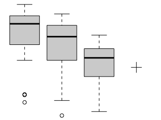
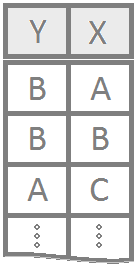

<!-- You can delete the following copyright statement if you wish: -->

<div style="color:gray;"><!-- Code to change the following paragraphs to gray text -->

This page, and all pages of this notebook, are meant to be customized to become a useful *Guide to Statistical Analysis* in R for your *current* and *future* self. 

<div style="font-size:.8em;"><!-- Code to shrink font-size of following paragraph -->

To begin customizing, [download](https://github.com/saundersg/Statistics-Notebook) your own copy of the book <span style="font-size:.8em;">(if you haven't already)</span>. Please note the [GNU General Public License](https://choosealicense.com/licenses/gpl-3.0/) when downloading. You are free to delete this commentary in your own copy of the notebook.

</div><!-- Ends smaller font-size section -->

</div><!-- End gray text section -->

<!-- End of download and copyright instructions. -->


## Table of Contents 


<!-- This is how to comment text out. You can comment out the above instructions if you wish. Comments allow the text to remain in the Rmd file, but not be displayed in the html file. -->

## {.tabset .tabset-fade}

### Hide
Welcome, Luis

### Show Notes

<!-- This is a great place to add general notes, then "Knit" the file to have your notes show up in your Statistics-Notebook. --------------- -->

install.packages("tidyverse")

library(tidyverse)

install.packages("mosaic")

library(mosaic)

install.packages("pander")

library(pander)

#Week #2 Notes

library(mosaic)

library(tidyverse)

library(pander)

View(KidsFeet)

boxplot(length ~ sex, data=KidsFeet)

KidsFeet %>%
  group_by(sex) %>%
  summarise(min=min(length),Q1=quantile(length,.25),median=median(length),
            Q3=quantile(length,.75),max=max(length)) %>%
  pander()

KidsFeet %>%
  group_by(sex) %>%
  summarise(min=min(length),Q1=quantile(length,.25),median=median(length),
            Q3=quantile(length,.75),max=max(length),mean=mean(length),stdev=sd(length),n=n()) %>%
  pander()

barplot(table(KidsFeet$sex))

pander(table(KidsFeet$sex))

plot(length ~ width, data=KidsFeet)

KidsFeet %>%
  summarise(Correlation=cor(length,width)) %>%
  pander()


Wow! I typed some words. Some <span style="color:blue;">blue words</span>, some <span style="background-color:yellow;">highlighted words</span>, some <span style="font-size:2em;">big words</span>.

Make a link to a meaningful page of the Statistics-Notebook: [Customization Help](RMarkdownHints.html) <- Read through this page!

Or to a page on the internet: [R Colors](http://www.stat.columbia.edu/~tzheng/files/Rcolor.pdf)

#Week 2 Notes

#Monday

library(mosaic)

library(tidyverse)

library(pander)

View(KidsFeet)

boxplot(length ~ sex, data=KidsFeet)

KidsFeet %>%
  group_by(sex) %>%
  summarise(min=min(length),Q1=quantile(length,.25),median=median(length),
            Q3=quantile(length,.75),max=max(length)) %>%
  pander()

KidsFeet %>%
  group_by(sex) %>%
  summarise(min=min(length),Q1=quantile(length,.25),median=median(length),
            Q3=quantile(length,.75),max=max(length),mean=mean(length),stdev=sd(length),n=n()) %>%
  pander()

barplot(table(KidsFeet$sex))

pander(table(KidsFeet$sex))

plot(length ~ width, data=KidsFeet)

KidsFeet %>%
  summarise(Correlation=cor(length,width)) %>%
  pander()

#Wednesday

library(tidyverse)
library(pander)
sort(table(starwars$homeworld))

rev(sort(table(starwars$homeworld)))

table(starwars$sex,starwars$gender)

###How to Filter

Example 1

View(Births78)

BirthsWedThu <- filter(Births78, wday %in% c("Wed","Thu"))

t.test(births ~ wday, data=BirthsWedThu, mu=0, alternative="two.sided", conf.level=0.95)

sw2<-filter(starwars,homeworld%in%c("Naboo","Tatooine"))sw2 <- filter(starwars, homeworld %in% c("Naboo","Tatooine"))

sw2 <- starwars %>% filter(homeworld %in% c("Naboo","Tatooine"))

sw3 <- filter(starwars, homeworld %in% c("Naboo","Tatooine") & species == "Human")

sw4 <- select(starwars, c("name","height","mass"))

sw5 <- select(starwars, sort(colnames(starwars)))

pander(table(starwars$hair_color))

starwars %>%
  filter(!is.na(sex)) %>%
  group_by(sex) %>%
  summarise(meanMass = mean(mass,na.rm=TRUE),StDevMass=sd(mass,na.rm=TRUE)) %>% pander()

starwars %>%
  filter(!is.na(sex)) %>%
  group_by(sex) %>%
  summarise(meanMass = mean(mass,na.rm=TRUE),StDevMass=sd(mass,na.rm=TRUE),SampleSize=n()) %>% pander()

sw6 <- mutate(starwars, Ratio=height/mass)

sw2 <- starwars

sw2$Ratio <- starwars$height/starwars$mass

stripchart(Utilities$totalbill, method="stack")

boxplot(Utilities$totalbill)

hist(Utilities$totalbill)

mean(circumference ~ age, data=Orange)

plot(circumference ~ age, data=Orange)

abline(h=100, lty=2)

#Week 3 Notes

#"ylim" helps scale a graph.
hist(KidsFeet$length, col = "orange", 
      xlab="Length", 
      ylim = c(0,12),
      main = "Length of Kids Feet\n In Centimeters")
      
###Boxplot Example

ggplot(KidsFeet, aes(x=factor(sex),y=length)) + geom_boxplot(fill="skyblue", color="black") + labs(title="Foot length vs Gender for Children",x="Gender",y="Length (cm)")

###Histogram Example

hist(KidsFeet$length, col = "orange", 
     xlab="Length (cm)", 
     # Adjusting Y limit
     ylim = c(0,12),
     main = "Length of Kids Feet")

###Scatterplot with Legend Example

palette(c("blue","pink"))
plot(length ~ width, data=KidsFeet, xlab="Width of Foot (cm)",ylab="Length of Foot (cm)",
     main="Fourth Grade Classroom Foot Sizes \n from Mary Meyer's Ann Arbor, MI Class Oct 1997",
     col=sex,pch=16)
legend("topleft",c("Boys","Girls"),pch=16,col=c("blue","pink"))

###Barplot with Legend Example

barplot(table(KidsFeet$sex,KidsFeet$domhand),beside=TRUE,
    main= "Fourth Grade Classroom Gender vs Dominant Hand \n from Mary Meyer's Ann Arbor, MI Class Oct 1997",
    xlab="Dominant Hand",ylab="Frequency",col=c("blue","pink"))
legend("topleft",c("Boys","Girls"),pch=16,col=c("blue","pink"))

#Week 4 Notes

### One Sample t
t_test(KidsFeet$length, mu = 28)

qqPlot(KidsFeet$length)

hist(KidsFeet$length)

### Paired t
differences <- KidsFeet$length - 3*KidsFeet$width

t.test(differences, mu = 0, alternative = "two.sided", conf.level = 0.95)
## another way to do the same test##

t.test(KidsFeet$length, 3*KidsFeet$width, paired=TRUE, mu=0, alternative="two.sided",conf.level=0.99)

qqPlot(differences)

hist(differences)

### Independent t
t.test(length ~ sex, data=KidsFeet, mu = 0, alternative = 'two.sided', conf.level = 0.95)

qqPlot(length ~ sex, data=KidsFeet)

stripchart(length ~ sex, data=KidsFeet, method="stack",pch=16)

#Week 5 Notes

#Wilcox test

#(W in wilcox test is the t statistic, Wilcox test is not the best when there is a lot of ties)

library(mosaic)

wilcox.test(length ~ sex, data=KidsFeet)

#(1+2+3...)

sum(1:50)

#ANOVA test Example

aovOut <- aov(length ~ as.factor(birthmonth), data=KidsFeet)
summary(aovOut)

#How to Filter Out Levels

mydata <- droplevels(filter(Friendly, condition != "SFR"))

#How to get names of all levels

levels()

#Cuts and 2-Way ANOVA

library(plotly)

library(mosaic)

library(tidyverse)

library(car)

Blackmore$ageGroup <- cut(Blackmore$age, c(7,10,12,14,18), labels=c("Youth","Pre-Teen","Early-Teen","Late-Teen"), ordered_result=TRUE)

table(Blackmore$ageGroup)

aovOut <- aov(exercise ~ group + ageGroup + group:ageGroup, data=Blackmore)

summary(aovOut)

par(mfrow = c(1,2))

plot(aovOut, which=1:2, pch=16)

xyplot(exercise ~ group, data=Blackmore, type=c("p","a"), 
       main="Groups", col='blue')
       
xyplot(exercise ~ ageGroup, data=Blackmore, groups=group, type=c("p","a"), 
       main="Significance of the Interaction", auto.key=list(corner=c(1,1)))
       
#How to delete a column

Blackmore3 <- select(Blackmore2, -ageGroup)

```{r}
mean(airquality$Temp)
```

#Dropping levels will make sure what you filtered out doesn't stop you from performing any test

Duncan1 <- droplevels(filter(Duncan, type %in% c("wc","prof")))

# Multiple Linear Regression

plot(mpg ~ qsec, data=mtcars,col=am+2,pch=16)

carlm <- lm(mpg ~ qsec + am + qsec:am, data=mtcars)

coef <- coef(carlm)

abline(a=coef[1],b=coef[2],col=2)
abline(a=coef[1]+coef[3],b=coef[2]+coef[4],col=3)

carlm2 <- lm(mpg ~ qsec +qsec:am, data=mtcars)

# (Equal Slopes)

palette(c("skyblue","firebrick"))

plot(mpg ~ qsec, data=mtcars, col=as.factor(am), xlim=c(0,30), 
     ylim=c(-30,40), main="1974 Motor Trend Cars", pch=16)

lmout <- lm(mpg ~ qsec + am, data=mtcars)
b <- coef(lmout)

abline(b[1],b[2], col=palette()[1])
abline(b[1]+b[3],b[2] , col=palette()[2])
legend("topleft", legend=c("automatic","manual"), pch=16, 
       col=palette(), title="Transmission (am)", bty="n")

# (Equal Intercepts)

palette(c("skyblue","firebrick"))
plot(mpg ~ qsec, data=mtcars, col=as.factor(am), xlim=c(0,30), 
     ylim=c(-30,40), main="1974 Motor Trend Cars", pch=16)

Mylm <- lm(mpg ~ qsec  + qsec:am , data=mtcars)
summary(Mylm)
b <- coef(Mylm)

abline(b[1],b[2], col=palette()[1])

abline(b[1],b[2]+b[3], col=palette()[2])

legend("topleft", legend=c("automatic","manual"), pch=1, col=palette(), 
       title="Transmission (am)", bty="n")

# (Full Model)

palette(c("skyblue","firebrick"))
plot(mpg ~ qsec, data=mtcars, col=as.factor(am), 
     xlim=c(0,30), ylim=c(-30,40), main="1974 Motor Trend Cars", pch=16)

lmout <- lm(mpg ~ qsec + am + qsec:am, data=mtcars)
b <- coef(lmout)

abline(b[1],b[2], col=palette()[1])
abline(b[1]+b[3],b[2]+b[4], col=palette()[2])

# Logistic Regression

loglm <- glm(sex=="B" ~ length, data=KidsFeet, family=binomial)
b <- coef(loglm)

plot(sex=="B" ~ length, data=KidsFeet, ylab='sex=="B"', main='KidsFeet Logistic Regression', pch=16)
curve(exp(b[1]+b[2]*x)/(1+exp(b[1]+b[2]*x)), col=2, add=TRUE)

predict(loglm,data.frame(length=25), type="response")

# Permutation Test

ttestout <- t.test(length ~ sex, data=KidsFeet)
observedTestStat <- ttestout$statistic

N <- 2000

permTestStats <- rep(NA, N)

for (i in 1:N) {
  permutedTest <- t.test(length ~ sample(sex), data=KidsFeet) 
  ## reorganize x or y
  
  # Or you can do this 
  #permutedData <- sample(KidsFeet$Sex)
  #permutedTest <- t.test(length ~ permutedData, data=KidsFeet)
  
  permTestStats[i] <- permutedTest$statistic
}

#### Step 3 - Compute the p-value

## look at our distribution of test statistics
hist(permTestStats, col="skyblue")
## add our original test statistic (possible pattern)
abline(v=observedTestStat,col="red",lwd=3)

### Compute the p-value / the area to the more extreme of our test statistic
### if 2 tailed test you have to multiple by 2 to get the tail on the other side
sum(permTestStats > observedTestStat) / N * 2

# Permutation Test (example 2)

# Create the data:
set.seed(1140411)
sample1 <- rnorm(30, 69, 2.5)
sample2 <- rnorm(30, 69, 2.5)
theData <- data.frame(values = c(sample1,sample2), group = rep(c(1,2), each=30))
View(theData)
boxplot(values ~ group, data = theData)

 

# Run the permutation test:

myTest <-  t.test(values ~ group, data= theData, mu=0)
observedTestStat <- myTest$statistic

 

N <- 2000      
permutedTestStats <-  rep(NA, N)
for  (i in 1:N ) {
   permutedData <- sample(x=theData$group)
   permutedTest <- t.test(values ~ permutedData, data= theData, mu=0)
   permutedTestStats[i]  <-  permutedTest$statistic
}
hist(permutedTestStats)
abline(v=observedTestStat)
sum(permutedTestStats >= observedTestStat)/N
sum(permutedTestStats <= observedTestStat)/N

# Permutation Test (example 3)

# observed test stat
myTest <- t.test(wt ~ cyl, data=cars)
testStat <- myTest$statistic

# permutate test statistics
N <- 1000
permTestStats <- rep(NA,N)

for (i in 1:N) {
  permTest <- t.test(sample(wt) ~ cyl, data=cars)
  permTestStats[i] <- permTest$statistic
}

# p-value
hist(permTestStats,xlim=c(-7,7))
abline(v=testStat,col="red")

sum(permTestStats < testStat)/N *2

# Permutation Test (example 4, Logistic Regression)

### Logistic Regression
library(mosaic)

myTest <- glm(sat > 1000 ~ expend, data=SAT, family="binomial")
testStat <- summary(myTest)[[12]][2,3]
  
## permutated tests
N <- 1000
permTestStats <- rep(NA,N)

for (i in 1:N) {
  permutedTest <- glm(sat > 1000 ~ sample(expend), data=SAT, family="binomial")
  permTestStats[i] <- summary(permutedTest)[[12]][2,3]
}

## p-value
hist(permTestStats,xlim=c(-3,3))
abline(v=testStat,col="red")

sum(permTestStats <= testStat)/N * 2


<!-- End your notes before here. ------------------------------------- -->
##

----

<div style="float:left;width:125px;" align=center class="tooltipimage">

  <span class="tooltipimagetext">Y is a single quantitative variable of interest. This would be like "heights" of BYU-Idaho students.</span>
</div>

## One Quantitative Response Variable Y {.tabset .tabset-pills}

### Graphics
<div style="padding-left:125px;color:black;">
<!-- Add your customizations in the area below: -->


Good plots would be 

Histograms (1 quantitative variable, good for large sample size),

Dot Plots (1 Quantitative Variable and 2+ Groups, best for small sample sizes or for datasets with lots of repeated values),

and 

Box Plots (1 Quantitative Variable and 2+ Groups, great for comparing the distributions of data across several groups or categories, sample size should be larger than 5).


<a href="GraphicalSummaries.html#histogram">
  
</a>
<a href="GraphicalSummaries.html#dot-plots">
  
</a>
<a href="GraphicalSummaries.html#boxplots">
  
</a>


<!--- End your notes before here.  ------------------>
</div>

### Tests
<div style="padding-left:125px;color:black;">
<!-- Add your customizations in the area below: -->

If normal assumption is met, [t_test](tTests.html) 

Analysis - [HS Senior](Analyses/t Tests/HighSchoolSeniors.html)


<!--- End of Add content area.  ------------------>
</div>


#
<div style="clear:both;"></div>

----

<div style="float:left;width:125px;" align=center class="tooltipimage">

  <span class="tooltipimagetext">Y is a single quantitative variable of interest. This would be like "heights" of BYU-Idaho students. X is a qualitative (categorical) variable of interest like "gender" that has just two groups "A" and "B". So this logo represents situtations where we would want to compare heights of male (group A) and female (group B) students.</span>
</div>

## Quantitative Y | Categorical X (2 Groups) {.tabset .tabset-pills}

### Graphics
<div style="padding-left:125px;color:black;">
<!-- Add your customizations in the area below: -->

Good plots would be 

Box Plots (1 Quantitative Variable and 2+ Groups, great for comparing the distributions of data across several groups or categories, sample size should be larger than 5),

and 

Dot Plots (1 Quantitative Variable and 2+ Groups, best for small sample sizes or for datasets with lots of repeated values).


<a href="GraphicalSummaries.html#boxplots">
  
</a>
<a href="GraphicalSummaries.html#dot-plots">
  
</a>


<!--- End of Add content area.  ------------------>
</div>

### Tests
<div style="padding-left:125px;color:lightgray;">
<!-- Add your customizations in the area below: -->


<!--- End of Add content area.  ------------------>
</div>


##
<div style="clear:both;"></div>

----

<div style="float:left;width:125px;" align=center class="tooltipimage">

  <span class="tooltipimagetext">Y is a single quantitative variable of interest, like "heights" of BYU-Idaho students. X is a categorical (qualitative) variable like which Math 221 you took, 221A, 221B, or 221C. In other words, X has three or more groups. So "Classrank" could be X, with groups "Freshman", "Sophomore", "Junior", and "Senior".</span>
</div>

## Quantitative Y | Categorical X (3+ Groups) {.tabset .tabset-pills}

### Graphics
<div style="padding-left:125px;color:black;">
<!-- Add your customizations in the area below: -->

Good plots would be 

Box Plots (1 Quantitative Variable and 2+ Groups, great for comparing the distributions of data across several groups or categories, sample size should be larger than 5),

and 

Dot Plots (1 Quantitative Variable and 2+ Groups, best for small sample sizes or for datasets with lots of repeated values).


<a href="GraphicalSummaries.html#boxplots">
  
</a>
<a href="GraphicalSummaries.html#dot-plots">
  
</a>

<!--- End of Add content area.  ------------------>
</div>

### Tests
<div style="padding-left:125px;color:lightgray;">
<!-- Add your customizations in the area below: -->

Add your own notes about appropriate inferential procedures for this type of data here.


<!--- End of Add content area.  ------------------>
</div>

#
<div style="clear:both;"></div>

----


<div style="float:left;width:125px;" align=center class="tooltipimage">

  <span class="tooltipimagetext">Y is a single quantitative variable of interest, like "heights" of BYU-Idaho students. X1 is a categorical (qualitative) variable like gender, with levels "boy" and "girl." X2 is another categorical (qualitative) variable like "Classrank" with levels "Freshman", "Sophomore", and "Junior". Of course, both X1 and X2 can have as many levels as you want to work with, but must have at least two levels each.</span>
</div>

## Quantitative Y | Multiple Categorical X {.tabset .tabset-pills}

### Graphics
<div style="padding-left:125px;color:black;">
<!-- Add your customizations in the area below: -->

Good plots would be 

Box Plots (1 Quantitative Variable and 2+ Groups, great for comparing the distributions of data across several groups or categories, sample size should be larger than 5),

and 

Dot Plots (1 Quantitative Variable and 2+ Groups, best for small sample sizes or for datasets with lots of repeated values).


<a href="GraphicalSummaries.html#boxplots">
  
</a>
<a href="GraphicalSummaries.html#dot-plots">
  
</a>

<!--- End of Add content area.  ------------------>
</div>

### Tests
<div style="padding-left:125px;color:lightgray;">
<!-- Add your customizations in the area below: -->

Add your own notes about appropriate inferential procedures for this type of data here.


<!--- End of Add content area.  ------------------>
</div>

#
<div style="clear:both;"></div>

----


<div style="float:left;width:125px;" align=center class="tooltipimage">

  <span class="tooltipimagetext">Y is a single quantitative variable of interest, like "height". X is another single quantitative variable of interest, like "shoe-size". This would imply we are using "shoe-size" (X) to explain "height" (Y).</span>
</div>

## Quantitative Y | Quantitative X {.tabset .tabset-pills}

### Graphics
<div style="padding-left:125px;color:black;">
<!-- Add your customizations in the area below: -->

A good plot would be a

Scatterplot (2 Quantitative Variables, values of data points are in (x,y) pairs, works well for small or large sample sizes, used in linear regression contexts).


<a href="GraphicalSummaries.html#scatterplots">
  
</a>

<!--- End of Add content area.  ------------------>
</div>

### Tests
<div style="padding-left:125px;color:lightgray;">
<!-- Add your customizations in the area below: -->

Add your own notes about appropriate inferential procedures for this type of data here.


<!--- End of Add content area.  ------------------>
</div>

#
<div style="clear:both;"></div>

----

<div style="float:left;width:125px;" align=center class="tooltipimage">

  <span class="tooltipimagetext">Y is a single quantitative variable of interest, like height. While we could use an X1 of "shoe-size" to explain height, we might also want to use a second x-variable, X2, like "gender" to help explain height. Further x-variables could also be used.</span>
</div>

## Quantitative Y | Multiple X {.tabset .tabset-pills}

### Graphics
<div style="padding-left:125px;color:black;">
<!-- Add your customizations in the area below: -->

A good plot would be a 

plotly Scatterplot (2 Quantitative Variables, values of data points are in (x,y)  pairs, works well for small or large sample sizes, used in linear regression contexts). This type of Scatterplot adds color and can change the sizing of the data when it's plotted.


<a href="GraphicalSummaries.html#scatterplots">
  
</a>

<!--- End of Add content area.  ------------------>
</div>

### Tests
<div style="padding-left:125px;color:lightgray;">
<!-- Add your customizations in the area below: -->

Add your own notes about appropriate inferential procedures for this type of data here.


<!--- End of Add content area.  ------------------>
</div>

#
<div style="clear:both;"></div>

----

<div style="float:left;width:125px;" align=center class="tooltipimage">

  <span class="tooltipimagetext">Y is a single categorical (qualitative) variable of interest where 1 (success) or 0 (failure) are the only possible values for Y. This would be like "getting an A in Math 325" where 1 means you got an A and 0 means you didn't. We might use an explanatory variable X of "height" to see if taller students are more likely to get an A in Math 325 than shorter students. (They aren't, if you were wondering.)</span>
</div>

## Binomial Y | Quantitative X {.tabset .tabset-pills}

### Graphics
<div style="padding-left:125px;color:lightgray;">
<!-- Add your customizations in the area below: -->

Add your own notes about graphics to use for this type of data here.


<a href="GraphicalSummaries.html#scatterplots">
  
</a>

<!--- End of Add content area.  ------------------>
</div>

### Tests
<div style="padding-left:125px;color:lightgray;">
<!-- Add your customizations in the area below: -->

Add your own notes about appropriate inferential procedures for this type of data here.


<!--- End of Add content area.  ------------------>
</div>

#
<div style="clear:both;"></div>

----

<div style="float:left;width:125px;" align=center class="tooltipimage">

  <span class="tooltipimagetext">Y is a single categorical (qualitative) variable of interest where 1 (success) or 0 (failure) are the only possible values for Y. This would be like "getting an A in Math 325" where 1 means you got an A and 0 means you didn't. We might use an explanatory variable X1 of "height" and a second explanatory variable X2 of "gender" to try to predict whether or not a student will get an A in Math 325.</span>
</div>

## Binomial Y | Multiple X {.tabset .tabset-pills}

### Graphics
<div style="padding-left:125px;color:lightgray;">
<!-- Add your customizations in the area below: -->

Add your own notes about graphics to use for this type of data here.


<a href="GraphicalSummaries.html#scatterplots">
  
</a>

<!--- End of Add content area.  ------------------>
</div>

### Tests
<div style="padding-left:125px;color:lightgray;">
<!-- Add your customizations in the area below: -->

Add your own notes about appropriate inferential procedures for this type of data here.


<!--- End of Add content area.  ------------------>
</div>

#
<div style="clear:both;"></div>

----

<div style="float:left;width:125px;" align=center class="tooltipimage">

  <span class="tooltipimagetext">Y is a single categorical variable of interest, like gender. X is another categorical variable of interest, like "hair color". This type of data would help us understand if men or women are more likely to have certain hair colors than the other gender.</span>
</div>

## Categorical Y | Categorical X {.tabset .tabset-pills}

### Graphics
<div style="padding-left:125px;color:black;">
<!-- Add your customizations in the area below: -->

A good plot would be a

Bar Chart (1 or 2 qualitative variables, depicts the number of occurrances for each category, no natural way to order the bars, called a Pareto Chart if the bars are ordered from tallest to shortest).


<a href="GraphicalSummaries.html#bar-charts">
  
</a>

<!--- End of Add content area.  ------------------>
</div>

### Tests
<div style="padding-left:125px;color:lightgray;">
<!-- Add your customizations in the area below: -->

Add your own notes about appropriate inferential procedures for this type of data here.


<!--- End of Add content area.  ------------------>
</div>

#
<div style="clear:both;"></div>

----

<footer></footer>

